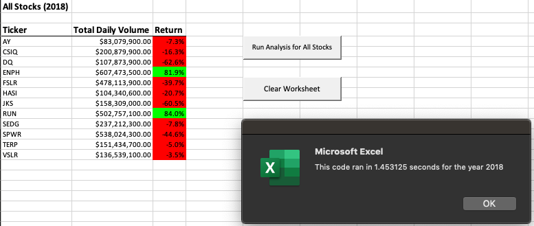
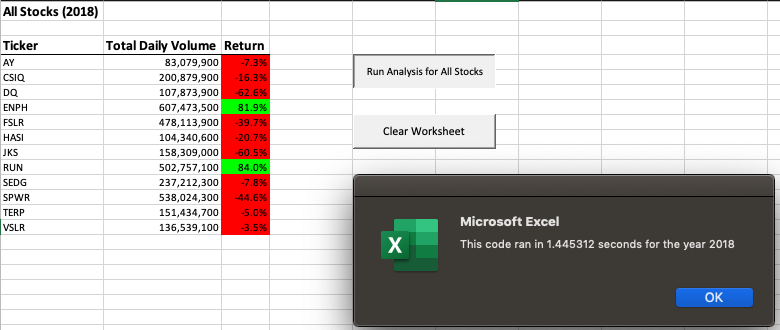

# Green Energy Stocks Analysis

## Overview of Project
The following project will look to an analysis of twelve (12) green energy stocks for the years 2017 and 2018 for Steve and his parents, who would like to begin investing in green energy stocks. The project will use VBA to automate the analysis of the trading volume of each stock as well as the return (change in starting and ending price) over the course of the year. An original script was developed to complete the analysis and then refactored so that it may run more efficiently and accurate when applied to more data, such as more stocks or the entire market rather than just twelve (12) green energy stocks.

### Purpose
The resulting analysis of the green energy stocks will provide a summary of information to Steve and his parents when selecting potential investments. The refactored code would allow the analysis to be applied to an expanded dataset for the entire stock market, with a reduction in run time.

## Results
### Stock Performance
The below analysis considers the performance from 2017 and 2018 of:
1. The trading volume of each green energy stock (Total Daily Volume)
2. The increase or decrease in the stock price from the beginning to the end of the year, as a percentage (Return)

As seen by the analysis, the majority of green energy stocks experienced positive results in 2017 but performance drastically plummeted in 2018. Of all twelve green energy stocks, only two had positive returns in 2018 but were significant amounts. 

The "DQ" stock that Steve's parents were specifically interested in showed the most drastic change, having gone from the highest returns in 2017 to the lowest returns in 2018. This would not be a recommended investment.

In comparing the volume of a stock against its returns, there does not seem to be a positive or negative correlation between the two. As an example, for the Green Stock "AY", there was a decrease in the stock price (return) from 2017 to 2018 as well as a decrease to its volume. On the other hand, the Green Stock "ENPH" experienced significant increases to its volume but a decrease in return.

Based on the analysis, "ENPH" and "RUN" are the two Green Stocks that should be considered for investment as they had an increase in volume and in returns between 2017 and 2018.

### Code Performance
As mentioned previously, a part of this project was to refactor the initial VBA script so that it can be optimized eventually for a larger dataset, rather than just focusing on twelve Green Stocks. In order to measure whether refactoring had an impact on the efficiency of the code, a timer was used to test whether the run time had decreased between the initial version of the refactored code.

*Run time for the 2017 analysis using the original code*

*Run time for the 2017 analysis using the refactored code*

*Run time for the 2018 analysis using the original code*

*Run time for the 2018 analysis using the refactored code*

As can be seen, there was a slight improvement in the run times for the VBA script after it was refactored. In the original code, there were two separate **for** loops to determine the volume and the returns separately. In the new code, variables are stored in an array so that the **for** loop runs all the elements at once for each year. While the difference in run times are not dramatic, the change may make more impact on a larger dataset to run code efficiently rather than through two separate loops.

## Conclusions
In general, refactoring code can provide many benefits to projects in the long-run and is seen as a good maintenance activity. While the creation of code for a specific purpose can be seen as useful, it has an even great benefit if that same code can be re-used or re-applied as the dataset changes, with minimal work. Refactoring not only aims to improve the efficiency of code in terms of run time but also in its readability and usefulness to the end user. This is not to say that refactoring should always be performed on every set of code. If refactoring is to take more effort than to write new code from scratch for the time and purpose, it would be preferred to not waste resources such as skill and money during a project. Refactoring should be done periodically and usually not to long code, which again can be time consuming. If the code works well for its purpose, it may not need any refactoring.

In this case specifically, refactoring was done to improve the efficiency of the code so that it can be used again with larger datasets. There is not a significant deviation from the original code but the refactored code did some slight improvements in the run time. The refactored code focused on reducing the amount of separate **for** loops that the code would have to run and better organization of the data into arrays. The success of the refactored code should be tested using a larger quantity of data to compare whether there are more significant improvements to run time.
